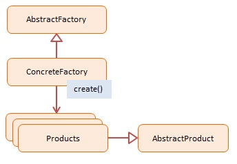

### Creation design Pattern
#### Abstract Factory
JavaScript does not support class-based inheritance therefore the abstract classes as depicted in the diagram are not used in the JavaScript sample. Abstract classes and interfaces enforce consistent interfaces in derived classes. In JavaScript we must ensure this consistency ourselves by making sure that each 'Concrete' object has the same interface definition (i.e. properties and methods) as the others

In the example we have two Concrete Factories: EmployeeFactory and VendorFactory. The first one creates Employee instances, the second one Vendor instances. Both products are person types (with the same interface) which allows the client to treat them the same. An array with two employees and two vendors is created. Each person is then asked to say what and who they are.

The log function is a helper which collects and displays results.
Participants
The objects participating in this pattern are:

- AbstractFactory -- not used in JavaScript
declares an interface for creating products
- ConcreteFactory -- In sample code: EmployeeFactory, VendorFactory
a factory object that 'manufactures' new products
the create() method returns new products
- Products -- In sample code: Employee, Vendor
the product instances being created by the factory
- AbstractProduct -- not used in JavaScript
declares an interface for the products that are being created




```javascript
// abstract factory pattern
class Employee {
	constructor(name) {
		this.name = name;

	}
	say() {
		console.log(`I am Employee:${this.name}`);
	}
}
class Vendor {
	constructor(name) {
		this.name = name;
	}
	say() {
		console.log(`I am Vendor:${this.name}`);
	}
}
class EmployeeFactory extends Employee {
	create(x) {
		return new Employee(x);
	}
}
class VendorFactory {
	create(x) {
		return new Vendor(x);
	}
}
const runObjets = ()=>{
	let persons = [];
	let employeeFactory = new EmployeeFactory();
	let vendorFactory = new VendorFactory();
	persons.push(employeeFactory.create("Tushar"));
	persons.push(vendorFactory.create("Kimi"));
	for(let person of persons){
		person.say();
	}
}
runObjets();
```

```javascript
function employee(name) {
	this.name = name;
	this.say = function() {
		console.log(`I am Employee: ${this.name}`);
	}
}

function vendor(name) {
	this.name = name;
	this.say = function() {
		console.log(`I am Vendor: ${this.name}`);
	}
}

function employeeFactory() {
	this.create = function(x) {
		return new employee(x)
	}
}

function vendorFactory() {
	this.create = function(x) {
		return new vendor(x)
	}
}
var runProcess = function() {
	var persons = [];
	persons.push(new employeeFactory().create("Tushar"));
	persons.push(new vendorFactory().create("Tushar"));
	for (var person of persons) {
		person.say();
	}
}
runProcess();
```

#### Builder
The Builder pattern allows a client to construct a complex object by specifying the type and content only. Construction details are hidden from the client entirely.

The most common motivation for using Builder is to simplify client code that creates complex objects. The client can still direct the steps taken by the Builder without knowing how the actual work is accomplished. Builders frequently encapsulate construction of Composite objects (another GoF design pattern) because the procedures involved are often repetitive and complex.

Usually it is the last step that returns the newly created object which makes it easy for a Builder to participate in fluent interfaces in which multiple method calls, separated by dot operators, are chained together (note: fluent interfaces are implementation of the Chaining Pattern as presented in the Modern patterns section).


Participants
The objects participating in this pattern are:

- Director -- In sample code: Shop
constructs products by using the Builder's multistep interface
- Builder -- not used in JavaScript
declares a multistep interface for creating a complex product
- ConcreteBuilder -- In sample code: CarBuilder, TruckBuilder
implements the multistep Builder interface
maintains the product through the assembly process
offers the ability to retrieve the newly created product
- Products -- In sample code: Car, Truck
represents the complex objects being assembled

```javascript
class Shop {
	constuctor() {}
	construct(builder) {
		builder.step1();
		builder.step2();
	return builder.get(); // Don't forget return of the function
	}
}
class CarBuilder {
	constuctor() {
		this.car = null;
	}
	step1() {
		this.car = new Car();
	}
	step2() {
		this.car.addParts();
	}
	get() {
		return this.car;
	}
}
class Car {

	constuctor() {
		this.doors = 0;
	}
	addParts() {
		this.doors = 4;
	}
	say() {
		console.log(`This is Car with doors ${this.doors}`);
	}
}

class Truck {
	constuctor() {
		this.doors = 0;
	}
	addParts() {
		this.doors = 2;
	}
	say() {
		console.log(`This is Truck with doors ${this.doors}`);
	}
}
class TruckBuilder {
	constuctor() {
		this.truck = null;
	}
	step1() {
		this.truck = new Truck();
	}
	step2() {
		this.truck.addParts();
	}
	get() {
		return this.truck;
	}
}
const runPattern = () => {
	let shop = new Shop();
	let carBuilder = new CarBuilder();
	let truckBuilder = new TruckBuilder();
	// shop.bind(carBuilder);
	// shop.bind(truckBuilder);
	let car = shop.construct(carBuilder);

	let truck = shop.construct(truckBuilder);
	car.say();
	truck.say();
}
runPattern();
```


```javascript
function Shop() {
	this.construct = function(builder) {
		builder.step1();
		builder.step2();
		return builder.get();
	}
}


function Car() {
	this.doors = 0;
	this.addParts = function() {
		this.doors = 4;
	}
	this.say = function() {
		console.log(`This is Car with doors ${this.doors}`);
	}
}

function CarBuilder() {
	this.car = null;
	this.step1 = function() {
		this.car = new Car();
	}
	this.step2 = function() {
		this.car.addParts();
	}
	this.get = function() {
		return this.car;
	}
}

function Truck() {
	this.doors = 0;
	this.addParts = function() {
		this.doors = 2;
	}
	this.say = function() {
		console.log(`This is Truck with doors ${this.doors}`);
	}
}

function TruckBuilder() {
	this.truck = null;
	this.step1 = function() {
		this.truck = new Truck();
	}
	this.step2 = function() {
		this.truck.addParts();
	}
	this.get = function() {
		return this.truck;
	}
}
const runPattern = () => {
	let shop = new Shop();
	let carBuilder = new CarBuilder();
	let truckBuilder = new TruckBuilder();
	// shop.bind(carBuilder);
	// shop.bind(truckBuilder);
	let car = shop.construct(carBuilder);

	let truck = shop.construct(truckBuilder);
	car.say();
	truck.say();
}
runPattern();
```

#### Factory Method
A Factory Method creates new objects as instructed by the client. One way to create objects in JavaScript is by invoking a constructor function with the new operator. There are situations however, where the client does not, or should not, know which one of several candidate objects to instantiate. The Factory Method allows the client to delegate object creation while still retaining control over which type to instantiate.

The key objective of the Factory Method is extensibility. Factory Methods are frequently used in applications that manage, maintain, or manipulate collections of objects that are different but at the same time have many characteristics (i.e. methods and properties) in common. An example would be a collection of documents with a mix of Xml documents, Pdf documents, and Rtf documents.


Participants
The objects participating in this pattern are:

- Creator -- In sample code: Factory
the 'factory' object that creates new products
implements 'factoryMethod' which returns newly created products
- AbstractProduct -- not used in JavaScript
declares an interface for products
- ConcreteProduct -- In sample code: Employees
the product being created
all products support the same interface (properties and methods)

```javascript
const employeeTypeEnum = {
	"fulltime": "fulltime",
	"parttime": "parttime",
	"temporary": "temporary",
	"contractor": "contractor"
};
class Factory {
	contractor() {}
	createEmployee(type) {
		var employee;
		switch (type) {
			case employeeTypeEnum.fulltime:
				employee = new FullTime();
				break;
			case employeeTypeEnum.temporary:
				employee = new Temporary();
				break;
			case employeeTypeEnum.parttime:
				employee = new PartTime();
				break;
			case employeeTypeEnum.contractor:
				employee = new Contractor();
				break;
			default:
				employee = new FullTime();
				break;
		}
		employee.type = type;
		employee.say = function() {
			console.log(this.type + ": rate " + this.hourly + "/hour");
		}
		return employee;
	}
};
class FullTime {
	hourly = "$12";
};
class PartTime {
	hourly = "$11";
};
class Temporary {
	hourly = "$10";
};
class Contractor {
	hourly = "$15";
};
const run = ()=> {
	var employees = [];
	var factory = new Factory();
	employees.push(factory.createEmployee("fulltime"));
	employees.push(factory.createEmployee("parttime"));
	employees.push(factory.createEmployee("temporary"));
	employees.push(factory.createEmployee("contractor"));
	for (var i = 0, len = employees.length; i < len; i++) {
		employees[i].say();
	}
}
run();
```

```javascript
var employeeTypeEnum = {
	"fulltime": "fulltime",
	"parttime": "parttime",
	"temporary": "temporary",
	"contractor": "contractor"
}

function Factory() {
	this.createEmployee = function(type) {
		var employee;
		switch (type) {
			case employeeTypeEnum.fulltime:
				employee = new FullTime();
				break;
			case employeeTypeEnum.temporary:
				employee = new Temporary();
				break;
			case employeeTypeEnum.parttime:
				employee = new PartTime();
				break;
			case employeeTypeEnum.contractor:
				employee = new Contractor();
				break;
			default:
				employee = new FullTime();
				break;
		}


		employee.type = type;

		employee.say = function() {
			console.log(this.type + ": rate " + this.hourly + "/hour");
		}

		return employee;
	}
}

var FullTime = function() {
	this.hourly = "$12";
};

var PartTime = function() {
	this.hourly = "$11";
};

var Temporary = function() {
	this.hourly = "$10";
};

var Contractor = function() {
	this.hourly = "$15";
};

function run() {
	var employees = [];
	var factory = new Factory();

	employees.push(factory.createEmployee("fulltime"));
	employees.push(factory.createEmployee("parttime"));
	employees.push(factory.createEmployee("temporary"));
	employees.push(factory.createEmployee("contractor"));

	for (var i = 0, len = employees.length; i < len; i++) {
		employees[i].say();
	}

}
run();
```